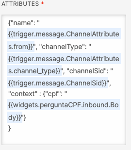

# Custom Task Attributes Plugin

This plugin allows agents to better see conversation context, especially considering information that was gathered by a chatbot, without the need to check conversation history.

The plugin adds a new tab to the **Task Panel** containing all info stored in an object called **context** within the Task attributes. That allows a chatbot to gather information such as customer ID, e-mail address, or whatever information that is relevant to the agent.

## Setup

Make sure you have [Node.js](https://nodejs.org) as well as [`npm`](https://npmjs.com). We support Node >= 10.12 (and recommend the _even_ versions of Node). Afterwards, install the dependencies by running `npm install`:

```bash
cd 

# If you use npm
npm install
```

Next, please install the [Twilio CLI](https://www.twilio.com/docs/twilio-cli/quickstart) by running:

```bash
brew tap twilio/brew && brew install twilio
```

Finally, install the [Flex Plugin extension](https://github.com/twilio-labs/plugin-flex/tree/v1-beta) for the Twilio CLI:

```bash
twilio plugins:install @twilio-labs/plugin-flex@beta
```

### Using Infra-as-code

If you want to deploy this plugin using an Infrastructure-as-code approach, you can find below how to do that using Pulumi. We recommend this strategy as it enables better control over components and can easily handle different environments/projects without the need to worry about environment variables.

#### Pulumi CLI

First, you need to install the Pulumi CLI in your system. This CLI will be needed to test your code. Please refer to this [link](https://www.pulumi.com/docs/reference/cli/). 

After installing the CLI, you need to login using `pulumi login`. By default, this will log in to the managed Pulumi service backend. If you prefer to log in to a self-hosted Pulumi service backend, specify a URL. For more information, please refer to this [link](https://www.pulumi.com/docs/reference/cli/pulumi_login/).  Also, check the `State and Backends` section to understand how states are handled. 

#### How to Use

1. Create you Pulumi project file by copying the example (`cp Pulumi.example.yaml Pulumi.yaml`) and setting name, runtime (keep as it is) and description.

2. Create the Pulumi stack for your current environment. For example, for dev you can run `pulumi stack init dev`.

3. For CI/CD environments, you need to add same environment variables to your secrets in your system. In the case of `GitHub Actions`, you can use `Secrets` as described [here](https://docs.github.com/en/actions/configuring-and-managing-workflows/creating-and-storing-encrypted-secrets). The mapping is as following:

- PULUMI_ACCESS_TOKEN
- TWILIO_<BRANCH_NAME>_ACCOUNT_SID
- TWILIO_<BRANCH_NAME>_AUTH_TOKEN

2. For development environment, you should copy the .dev.env.example (`cp .dev.env.example .dev.env`) and fill out the variables. Also, do not forget to add `.dev.env` files to all your serverless directories. After that, you can run the package scripts without the `ci:` in the beginning of their names. For example: 

- **deploy-resources**: deploy all resources to your dev project
- **preview-resources**: preview all changes to your dev project

If you want to test different branches locally, you can change the environment variables for each branch. Remember, the idea is that each branch/stack is a different Twilio Project (but you can change this abstraction depending on your use case). 

**Remember:** if you deploy this repository, it may incur cost from Twilio side.    

#### CI/CD with Pulumi

For this project, we are going to use `Github Actions` with Pulumi as described [here](https://www.pulumi.com/docs/guides/continuous-delivery/github-actions/). If you want to implmenet it with other CI/CD environment, please refer to this [link](https://www.pulumi.com/docs/guides/continuous-delivery/).

In this project, you can check how to configure it by checking workflow files inside `.github/workflows`.

## Using Custom Attributes

This plugin will read everything on the **context** object within the Task Attributes and renders them in the screen (key and value). This approach was taken to render only relevant information to the agent.

When handing off a conversation to an agent on Flex, pass the **context** object like the example below:



## Development

Run `twilio flex:plugins --help` to see all the commands we currently support. For further details on Flex Plugins refer to our documentation on the [Twilio Docs](https://www.twilio.com/docs/flex/developer/plugins/cli) page.

